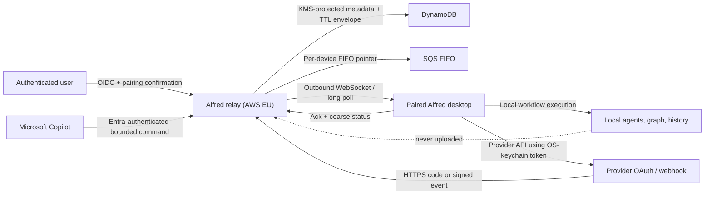

# ADR 011: Optional cloud relay architecture gate

- **Status:** Proposed — implementation blocked pending named approvals
- **Date:** 2026-08-13
- **Decision owners:** Product owner **TBD**; security owner **TBD**; privacy/support owner **TBD**; on-call owner **TBD**
- **Related plans:** 008, 010, 011, 012, 017

## Decision to approve

Alfred should add an optional, EU-hosted, short-retention relay for device
pairing, confidential OAuth callbacks, verified provider webhooks, offline
event queues, and authenticated remote workflow commands. Workflow graphs,
agent execution, full run logs, and arbitrary workflow output remain local.

This ADR proposes the architecture but does not authorize an account system,
cloud resources, data collection, deployment, or provider production app. Work
must stop after this document until every approval field at the end is named
and accepted.

## Proposed v1 choices

### 1. Hosting, runtime, region, database, queue, and keys

- **Cloud and region:** AWS, primary `eu-west-1` (Ireland), with no active
  multi-region failover in v1. Store all persistent relay data in that region.
  Route 53/CloudFront edge metadata is allowed, but envelope bodies must not be
  cached at the edge.
- **Runtime:** TypeScript bundled for AWS Lambda `nodejs24.x`. AWS currently
  documents Node.js 24 on Amazon Linux 2023 as a supported Lambda runtime.
- **Ingress:** API Gateway HTTP API for OIDC, pairing, callbacks, status, and
  long-poll fallback; API Gateway WebSocket API for the normal desktop channel.
- **Database:** DynamoDB with point-in-time recovery and TTL for tenant/user,
  device, installation, pairing, publication, idempotency, envelope state, and
  sanitized audit metadata. Every access path begins with the tenant key.
- **Queue:** SQS FIFO carries per-device wake/delivery pointers. DynamoDB is the
  authoritative envelope state, so an SQS redelivery or reconnect cannot create
  a second command. `MessageGroupId = tenant_id#device_id`; the envelope ID is
  the deduplication ID.
- **Keys/secrets:** AWS KMS customer-managed keys protect service signing keys,
  confidential provider client/signing secrets, and any transient server-side
  grant material. Device-bound content uses an audited sealed-box construction
  to the device-generated public key; KMS is not a substitute for the device
  key. Secrets Manager stores provider configuration encrypted by KMS.
- **Edge protection:** AWS WAF, explicit body/time limits, provider-specific
  signature verification, rate limits, and CloudWatch metrics with body/data
  logging disabled.

Rationale: the workload is bursty, the desktop channel has no inbound port,
and the data model is key/value plus short-lived state machines. Serverless
components avoid a continuously running container while retaining a managed
queue, regional database, KMS, and WebSocket endpoint. The tradeoff is more
state-machine complexity and AWS coupling; contract tests and an OpenAPI
boundary are mandatory.

Official references: [AWS Lambda runtimes](https://docs.aws.amazon.com/lambda/latest/dg/lambda-runtimes.html), [Node.js on Lambda](https://docs.aws.amazon.com/lambda/latest/dg/lambda-nodejs.html), [API Gateway WebSocket APIs](https://docs.aws.amazon.com/apigateway/latest/developerguide/apigateway-websocket-api.html), [DynamoDB TTL](https://docs.aws.amazon.com/amazondynamodb/latest/developerguide/TTL.html), [SQS FIFO delivery](https://docs.aws.amazon.com/AWSSimpleQueueService/latest/SQSDeveloperGuide/FIFO-queues-exactly-once-processing.html), and [AWS KMS concepts](https://docs.aws.amazon.com/kms/latest/developerguide/concepts.html).

### 2. Identity and Microsoft Entra

- Use an Amazon Cognito user pool as the Alfred relay OIDC authority.
- Support a normal consumer sign-in method only after product/privacy review.
- Require a federated Microsoft Entra organizational identity before enabling
  Copilot publication. Validate issuer, audience, nonce, `tid`, and immutable
  subject; bind the Entra tenant ID to the Alfred organization. Tenant switching
  requires explicit device re-pairing.
- Do not accept anonymous Copilot commands. Current Microsoft guidance for
  Microsoft 365 Copilot extensions uses Entra-protected APIs, and multi-tenant
  Entra apps must validate tenant/issuer claims rather than trusting an email
  domain.
- Treat Microsoft Entra Agent ID as a later, separate compatibility review. It
  is evolving and must not silently change v1 identity or consent semantics.

Official references: [Microsoft Entra multitenant authentication](https://learn.microsoft.com/en-us/entra/architecture/authenticate-applications-and-users), [Entra SSO for Microsoft 365 Copilot extensions](https://learn.microsoft.com/en-us/microsoft-365/copilot/extensibility/plugin-authentication-entra-sso), and [Microsoft Entra Agent ID overview](https://learn.microsoft.com/en-us/entra/agent-id/agent-identities).

### 3. Provider-token custody

- Keep access/refresh tokens local in the OS credential store whenever native
  PKCE permits it.
- For confidential-client flows, the relay exchanges the authorization code,
  immediately encrypts the grant to the paired device public key, queues it for
  at most two minutes, and deletes the envelope after device acknowledgement.
- The relay may hold provider client/signing secrets in Secrets Manager/KMS.
  It does not become a general provider-token vault in v1.
- A provider that cannot support this one-time transfer needs a new approved ADR
  before cloud token custody is introduced.

### 4. Retention and queued previews

| Data | Proposed hard TTL | Content rule |
| --- | ---: | --- |
| Pairing challenge | 5 minutes | Random challenge, user/tenant/device intent only |
| OAuth state | 10 minutes | Provider/user/device/attempt binding only |
| One-time provider grant | 2 minutes | Device-encrypted; delete on acknowledgement |
| Remote run command | 15 minutes | Bounded published input only |
| Provider event | 6 hours | Allow-listed normalized fields; preview only as device-encrypted opt-in |
| Idempotency/ack state | 24 hours | IDs and coarse terminal state only |
| Sanitized security audit metadata | 30 days | Actor IDs, action, time, result/error code; no bodies or previews |

Encrypted provider-event previews are permitted only when a user explicitly
enables offline content for that trigger. They remain capped at 1,000 Unicode
characters, are encrypted to one device before durable storage, and expire
after six hours. Default events carry IDs/routing metadata only so the desktop
can fetch detail on demand. Raw bodies, headers, signatures, attachments,
mailboxes, thread history, workflow graphs, run logs, and agent output are never
queued.

### 5. Tenancy and identifiers

Use opaque random identifiers; never use email or a provider workspace ID as a
primary tenant boundary.

```text
tenant_id
  user_id (Cognito subject + issuer)
    device_id (public-key fingerprint, name, app version)
  provider_installation_id (provider + external tenant/install digest)
  published_workflow_id (opaque relay ID mapped locally to a workflow)
    envelope_id / run_request_id / idempotency_key
```

Every database key, queue message, token audience, WebSocket connection, and
authorization check carries `tenant_id`, `user_id`, and (where applicable)
`device_id`. External provider IDs are routing attributes, never authorization
boundaries. A user may belong to several Alfred tenants, but one paired device
has exactly one active tenant binding.

### 6. Availability and expiry

- Delivery is at least once; desktop receipt/command deduplication supplies
  exactly-once workflow enqueueing.
- Queue while the paired desktop is offline, then deliver on reconnect before
  the hard TTL. An expired command/event becomes a visible `expired` terminal
  state and is never executed later.
- WebSocket is primary. HTTPS long poll uses the same cursor/envelope protocol
  and is a compatibility fallback, not a separate trust path.
- V1 is single-region. A regional outage delays delivery until recovery or TTL;
  it does not fail over to a region with a second copy of user content.

### 7. Protocol and desktop compatibility

- All envelopes use an integer `schema_version`, stable message type, immutable
  envelope ID, idempotency key, issued/expiry timestamps, tenant/user/device
  IDs, and authenticated signature context.
- Add fields only as optional. Never change an existing field's meaning.
- The relay supports the current and immediately previous desktop protocol for
  a maximum of 90 days. Older clients receive `upgrade_required`; they never
  receive an envelope they cannot validate.
- Unknown versions, wrong tenant/device, replayed IDs, expired timestamps,
  oversized content, or invalid state transitions fail closed.

### 8. Code location, stack, and publication

- Put the service in this repository under `relay/` so protocol fixtures can be
  shared and desktop/relay compatibility is reviewed together.
- Use TypeScript, AWS SDK v3, AWS CDK, an OpenAPI 3.1 contract, JSON Schema, and
  property/contract tests. Lambda runs bundled JavaScript on Node.js 24; Bun is
  the local package/test/build tool, not the production runtime.
- A dedicated relay CI workflow may synthesize/test on pull requests. Only a
  protected environment with an approved human reviewer may deploy staging or
  production. Desktop release CI never receives cloud deployment credentials.

Commands to use only after this ADR is approved and `relay/` is scaffolded:

```sh
bun --cwd relay install --frozen-lockfile
bun --cwd relay run lint
bun --cwd relay test
bun --cwd relay run typecheck
bun --cwd relay run build
bun --cwd relay run contract:test
bun --cwd relay run cdk:synth
bun --cwd relay run db:migrate
bun --cwd relay run dev
```

The relay team owner, CI publisher owner, AWS account owner, DNS/certificate
owner, and monthly cost ceiling remain **TBD** and are blocking decisions.

## Data flow



For confidential OAuth, the relay receives the code, exchanges with a
KMS-protected client secret, encrypts the resulting grant to the device public
key in memory, and queues only that ciphertext. For provider events, signature
verification precedes normalization, routing, optional device encryption, and
TTL persistence.

## Threat model

| Threat | Required controls | Verification gate |
| --- | --- | --- |
| OAuth code interception/state swapping | Random single-use state bound to provider/user/tenant/device/attempt; exact redirect URI; PKCE where supported; 10-minute TTL | Wrong provider/user/device, reused, expired, and missing-state fixtures fail |
| Device-pair hijack | Desktop-generated key; 5-minute single-use challenge; matching human-readable code in both surfaces; authenticated confirmation; no email-link-only pairing | Wrong-user confirmation, replay, race, and expired challenge tests |
| Webhook forgery | Provider signature over raw bounded bytes; timestamp freshness; content-type/body limits; installation lookup only after verification | Forged, old, malformed, oversized, and wrong-installation fixtures |
| Replay/duplicate delivery | Provider delivery ID + relay idempotency key + signed envelope ID; conditional DynamoDB writes; desktop Plan 010 receipt | Duplicate ingress/delivery returns same state and creates one local run |
| Tenant confusion / IDOR | Tenant-prefixed keys; issuer/audience/`tid` validation; authorization checks on every hop; indistinguishable not-found | Cross-tenant property and penetration tests across every endpoint/state transition |
| Queue scraping | Least-privilege IAM; per-device encryption; no body logs; KMS/Secrets Manager; short TTL; production access audit | IAM review and database/queue/log snapshot search for plaintext fixtures |
| Stolen provider refresh token | Local-first custody; one-time encrypted grants; KMS-protected client secrets; immediate revoke/uninstall hooks | Lost-device revoke and fixture exfiltration tests; no reusable grant after ack/TTL |
| Prompt injection in provider content | Normalize/allow-list; label as untrusted; bounded encrypted preview opt-in; destructive workflow confirmation policy | Injection fixture remains data and cannot broaden remote command permissions |
| Account/device revocation | Server-side device/session revoke; installation unlink; WebSocket disconnect; reject future acks; local keychain cleanup | Revocation during connection, queue, and command tests |
| Stale/destructive command | Explicit workflow publication, bounded schema, 15-minute TTL, idempotency, local revalidation, confirmation/policy | Expired/unpublished/invalid/destructive command never starts |
| Service/operator data exposure | No workflow graph/output; content-free logs/metrics; encrypted preview; access controls; deletion/export runbook | Snapshot/log search, access review, and deletion SLA test |

## Privacy, support, security, and operations gate

Before service implementation, the approving owners must set:

- public privacy notice and data-processing/subprocessor list;
- support contact and deletion/export SLA;
- vulnerability intake and security incident owner;
- 24/7 vs business-hours on-call expectation and user-facing availability;
- AWS budget alerts and an explicit monthly cost ceiling;
- production/staging AWS accounts, DNS/certificate owner, backup/PITR policy,
  key rotation owner, and provider-secret rotation owner;
- regions/countries allowed at launch and whether an EU-only service is
  commercially acceptable.

## Rejected alternatives

- **Expose the desktop webhook through a tunnel:** no device identity, tenant
  boundary, durable expiry, or safe confidential OAuth secret custody.
- **Run workflows in the cloud:** uploads graph/agent context and creates a much
  larger execution, billing, isolation, and credential system.
- **Store provider grants in the relay by default:** changes the breach impact
  and revocation model; requires a separate ADR and migration.
- **Long-lived plaintext event storage:** unnecessary for delivery and contrary
  to Alfred's local-first boundary.
- **Anonymous remote workflow URLs:** cannot provide tenant-safe revocation,
  publication policy, or meaningful auditability.

## Approval record (blocking)

All rows must be completed before Plan 011 Step 2 or any `relay/` service code.

| Role / decision | Name | Decision | Date |
| --- | --- | --- | --- |
| Product owner: scope, preview opt-in, availability | **TBD** | Pending | — |
| Security owner: threat model, identity, key design | **TBD** | Pending | — |
| Privacy/support owner: notice, deletion/export, subprocessors | **TBD** | Pending | — |
| On-call/service owner | **TBD** | Pending | — |
| AWS account + monthly cost ceiling | **TBD** | Pending | — |
| Entra/Copilot tenant model | **TBD** | Pending | — |
| Repository/CI/DNS ownership | **TBD** | Pending | — |

Until this table is approved, Plan 011 is blocked at its mandatory architecture
gate. Plans 010 and the local/private portions of provider integrations may
continue without the relay.
